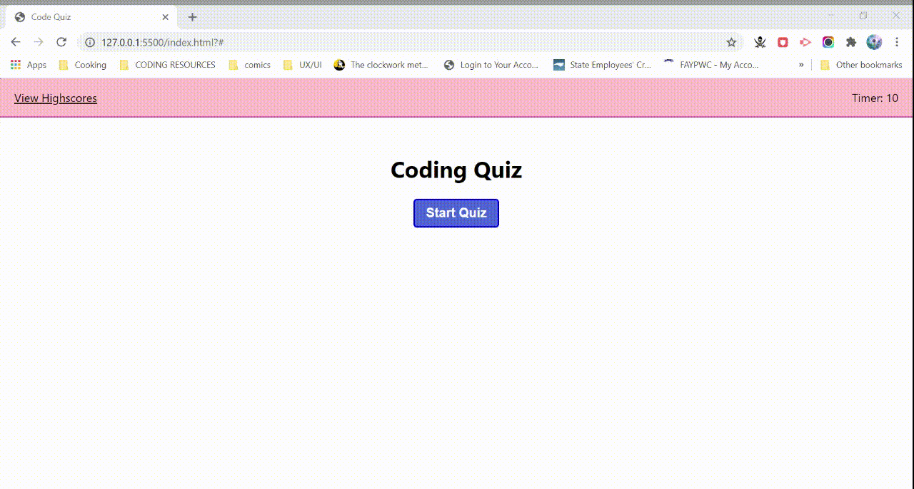

# Code-Quiz

## Deployed Project
[Live project in its WIP state](https://anishamcdowell.github.io/Code-Quiz/)

## Screenshot

## Project Description
The purpose of this project was to make a quiz app that would dynamically display questions and track a user's input and cummulative score using Javascript. While the quiz runs, a timer counts down showing the user how much time left they have to complete their quiz. If a correct answer is select the user can continue the quiz as usual, but for every incorrect selection the timer loses 10 seconds.

I tried to make the HTML component of the quiz in a form consisting of radio buttons, that way the user could only select one option before moving on to the next question. The idea was that following the user selection, my Javascript would capture the user's input and compare it to an array that holds the index value of the correct answer. If the index value that the user selected matched that of the correct answer stored in my script, the local storage would store the user's points to be displayed at the end of the quiz.

I struggled with how to actually capture user input on the form though, and how to get the script to generate *all* of the questions and answer options from my arrays in the question and answer divs. My idea was to create a for loop that would display the next question in an array when the user selected the next button. I was only able to get the quiz to generate two unique questions despite having an array of five unique questions.

As for the the countdown, I was able to get the initial timer to begin running and to display a "time's up" message which offers the user the option to view their score or to restart the quiz. As I could not capture user input, the retry quiz button is currently the only dynamic element of the "time's up" display screen.