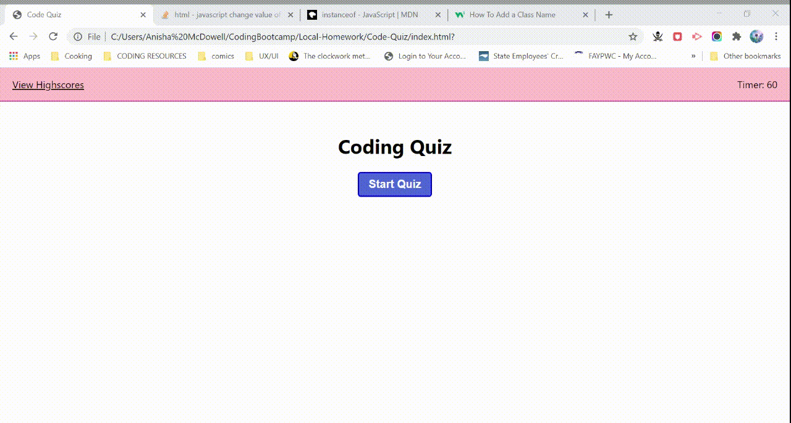

# Code-Quiz

## Deployed Project
[Live project in its WIP state](https://anishamcdowell.github.io/Code-Quiz/)

## Screenshot

## Project Description
The purpose of this project was to use Javascript to make a quiz app that would dynamically display questions with answer options, as well as track a user's input and cumulative score. The app is meant to hold onto every final score and produce a highscores list as a result. While the quiz runs, a timer counts down showing the user how much time left they have to complete their quiz.

I struggled figuring out how to capture user input from the quiz buttons and how to store the button selection in local storage so I did not have any values for my script to assess as right/wrong in order to produce a final score. Because I could not capture user input, the part of the quiz that is meant to reduce the timer by 10 seconds for every incorrect answer is not functional. Despite that, I was able to correctly create a timer function that when it reaches zero clears the quiz and prompts the user to restart. 